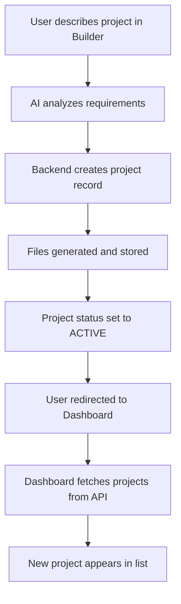

# AI Builder and Dashboard Integration

## Overview
This document explains how the AI Builder and Dashboard components are integrated to provide a seamless experience for users building and managing their applications.

## Integration Flow

### 1. Project Creation in Builder
When a user creates a project in the AI Builder:
1. User describes their application idea
2. AI analyzes the requirements
3. Backend API creates a project record in the database
4. Project files are generated and stored
5. Project status is set to ACTIVE
6. User is automatically redirected to the Dashboard

### 2. Project Display in Dashboard
The Dashboard now fetches real projects from the backend:
1. On load, Dashboard calls the Projects API
2. Projects are retrieved from the database
3. Projects are displayed with real data including:
   - Project name and description
   - Creation and modification dates
   - Technology stack
   - Status (active, building, deployed, etc.)
   - Features list

### 3. Automatic Updates
When a new project is created:
1. Builder creates project in database
2. Dashboard automatically fetches updated project list
3. New project appears immediately in the project list

## Technical Implementation

### Dashboard Updates
- Replaced mock data with real API calls
- Added loading states for better UX
- Implemented error handling with fallback to mock data
- Added automatic project fetching on component mount

### Builder Updates
- Ensured proper API calls to backend for project creation
- Added automatic navigation to Dashboard after project creation
- Maintained progress tracking during project generation

### Data Flow

## Benefits
1. **Real-time Visibility**: Projects appear immediately in Dashboard after creation
2. **Consistent Data**: Same project data is used across all components
3. **Better UX**: Users can see their projects without manual refresh
4. **Error Handling**: Graceful fallback to mock data if API fails

## Testing the Integration
1. Navigate to the AI Builder
2. Create a new project by describing an application
3. Wait for the creation process to complete
4. Verify automatic redirection to Dashboard
5. Confirm the new project appears in the project list
6. Check that project details are displayed correctly

## API Endpoints Used
- **Project Creation**: `POST /api/builder/generate`
- **Project Retrieval**: `GET /api/projects/`

## Data Models
- **Project**: Stored in `projects` table with all relevant metadata
- **Project Files**: Stored in `project_files` table with content