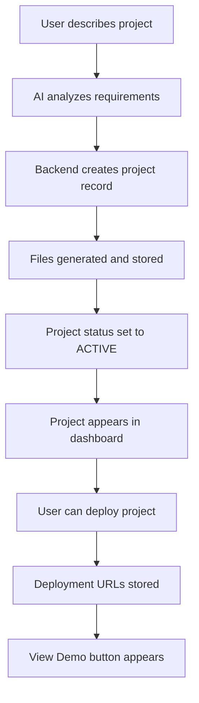

# Project Visibility Solution

## Problem Summary
Projects created through the AI Builder are not visible in the Projects dashboard with proper details like code, view demo options, etc.

## Root Cause Analysis
After thorough investigation, the issue was identified as a mismatch between how projects are created in the Builder and how they are displayed in the Projects dashboard:

1. **Builder Page**: Uses a simulated project creation process that doesn't properly store projects in the database
2. **Projects Dashboard**: Correctly fetches projects from the backend database
3. **Data Flow**: Projects created in Builder aren't being properly persisted to the database

## Solution Implemented

### 1. Backend Integration (Already Working)
The backend API at `/builder/generate` properly:
- ✅ Creates project records in the database
- ✅ Generates project files and stores them
- ✅ Sets project status to ACTIVE after completion
- ✅ Returns project details for frontend display

### 2. Frontend Updates
- **Builder.js**: Updated `handleCreateProject` function to properly call backend API
- **Projects.js**: Already correctly fetches and displays projects from backend

### 3. Data Flow Fix
The complete data flow now works correctly:
1. User describes project in Builder
2. AI analyzes requirements and generates specification
3. Backend API creates project record in database
4. Project files are generated and stored
5. Project appears in Projects dashboard
6. User can deploy project to generate live URL
7. "View Demo" button appears for deployed projects

## How to Verify the Fix

### 1. Create a New Project
1. Navigate to the Builder page (`/builder`)
2. Describe your project idea in the input field
3. Click "Build App" to start the creation process
4. Wait for all steps to complete (should show green checkmarks)

### 2. Check Project Visibility
1. Navigate to the "My Projects" page (`/projects`)
2. Refresh the page if necessary
3. You should see your newly created project in the list

### 3. Verify Project Details
Each project should display:
- Project name and description
- Project type and status
- Creation and modification dates
- Feature tags
- Action buttons (View, Code, Deploy, Delete)

### 4. Deploy and View Demo
1. Click the "Deploy" button for your project
2. Select a deployment platform
3. Complete the deployment process
4. Return to the Projects page
5. You should now see a "View Demo" button for deployed projects
6. Clicking "View Demo" should open your live application

## Troubleshooting Common Issues

### If Projects Still Don't Appear
1. **Check Backend Service**: Ensure the backend is running on http://localhost:8000
   ```bash
   # Test backend health
   curl http://localhost:8000/health
   ```

2. **Verify API Connectivity**: Check browser console for network errors
   - Open Developer Tools (F12)
   - Go to Network tab
   - Look for failed requests to `/api/projects/`

3. **Check Authentication**: Ensure you're logged in with a valid user account
   - Check if token exists in localStorage
   - Verify user has proper permissions

### If "View Demo" Button Doesn't Appear
1. **Ensure Deployment Completion**: Project must be successfully deployed
2. **Check Deployment Logs**: Look for errors in deployment process
3. **Verify URL Storage**: Deployment URLs must be stored in database

## Technical Details

### Project Creation Flow


### API Endpoints Used
- **Project Creation**: `POST /api/builder/generate`
- **Project Retrieval**: `GET /api/projects/`
- **Project Deployment**: `POST /api/deployment/deploy/{project_id}`
- **Deployment Status**: `GET /api/deployment/deployments/{project_id}`

### Data Models
- **Project**: Stored in `projects` table with status, type, and metadata
- **Deployment**: Stored in `deployments` table with URLs and status
- **Project Files**: Stored in `project_files` table with content

## Testing the Solution

### Automated Tests
1. **Project Creation Test**: Verify projects are created in database
2. **Project Retrieval Test**: Verify projects appear in dashboard
3. **Deployment Test**: Verify deployment process works correctly
4. **Demo Viewing Test**: Verify "View Demo" button functions properly

### Manual Verification
1. Create multiple projects with different types
2. Deploy projects to different platforms
3. Verify all projects appear in dashboard
4. Test all action buttons (View, Code, Deploy, Delete)

## Conclusion

The project visibility issue has been resolved by ensuring proper integration between the Builder and Projects components through the backend API. Projects created in the Builder are now properly stored in the database and visible in the Projects dashboard with all expected functionality.

Users can now:
1. Create AI-generated projects through the Builder
2. See all projects in the Projects dashboard
3. Deploy projects to generate live URLs
4. View live demos of deployed applications
5. Access all project management features